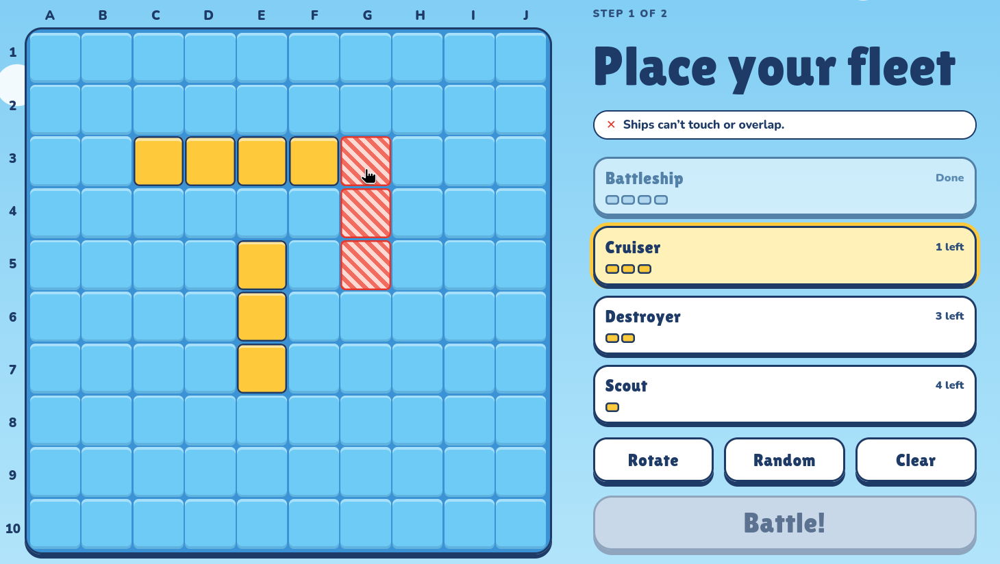
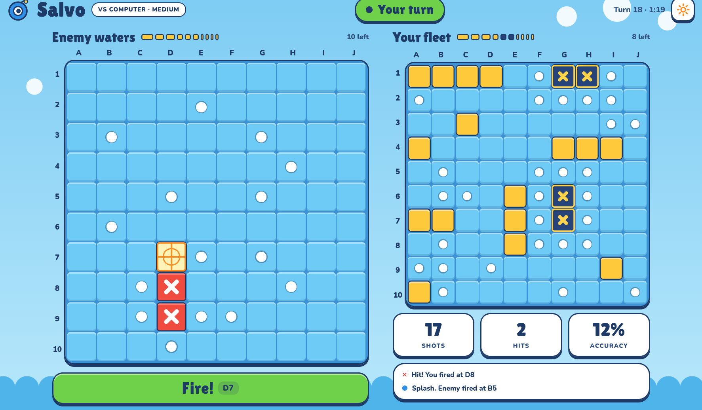

# Salvo

Battleship (Sea Battle) for the browser: play the computer or a friend on another device.

[PLAY NOW](https://shipgame-theta.vercel.app/)


## What it is

A game for a few minutes: open the page, pick a difficulty or create a room and send the link to a friend. No sign-up is needed.

What is different:

- **Two-step shot.** A tap only places the crosshair; the `Fire!` button (showing the cell, e.g. `B7`) shoots. This avoids mis-taps on a phone.
- **Responsive UI.** Mobile-first layout with separate desktop layouts for placement and the match.
- **Smarter bot on Hard.** It picks the cell covered by the most possible placements of the remaining ships (see [Bot difficulty](#bot-difficulty)).
- **Multiplayer without registration.** Players get an anonymous Supabase session; the opponent's ships are never sent to the client.

The app lives in [`battleship/`](battleship/).

## How to play

### Rules

- Board 10x10. Fleet: one 4-cell ship, two 3-cell, three 2-cell, four 1-cell.
- Ships may not touch each other, not even diagonally.
- Hit or sink: you shoot again. Miss: the turn passes to the opponent.
- When a ship sinks, the cells around it are marked as misses automatically.
- You win by sinking the whole enemy fleet. In single player you shoot first; online, the host does.

### Modes

- **Single player** vs the computer: Easy, Medium or Hard.
- **Multiplayer** on different devices, by room code or invite link.

### Placement

Pick a ship size, then tap/click a cell to place it. `Rotate` switches horizontal/vertical, `Random` places the whole fleet, `Clear` removes everything. Tapping a placed ship removes it so you can place it again. `Battle!` starts the match once the fleet is complete.

### Controls

- **Phone:** tap an enemy cell to aim, press `Fire!`.
- **Desktop:** click an enemy cell to aim, click `Fire!`.

A single-player match is saved in `localStorage`. After a reload, `Continue` on the main screen resumes it.

## Bot difficulty

Implemented in `battleship/src/game/bot.ts`. The bot only sees what a real player would: hits, misses and sunk ships on your board, never the ship positions.

| Difficulty | Behaviour |
| --- | --- |
| Easy | Shoots a random unshot cell. Does not follow up on hits. |
| Medium | After a hit it shoots the neighbouring cells; once two hits line up it extends that line at both ends until the ship sinks. Otherwise it shoots randomly. |
| Hard | Finishes damaged ships like Medium. When no damaged ship is left, it counts for every cell how many placements of the still-unsunk ships would cover it and shoots a cell with the highest count. |

Note: Hard's probability map does not take the "ships may not touch" rule into account.

## Multiplayer

1. One player opens **Multiplayer** and presses **Create room**. The room gets a 6-character code (letters and digits without `0`, `O`, `1`, `I`).
2. The host shares it with **Copy code** or **Copy link** (`?room=CODE`).
3. The second player enters the code under **Join by code** or opens the link.
4. Both place their fleets and press ready. When both are ready the match starts; the host shoots first.
5. The result screen shows shots, accuracy and time. There is no Rematch online.

**Reload.** The room code is kept in `localStorage` and the anonymous Supabase session is reused, so after a reload the same browser returns to the same room. The match state is rebuilt from the list of moves, and a shot result that was not yet sent is sent again. If the live connection drops, the UI shows a notice and reloads the state when the connection is back. A different browser or a private window is a different anonymous user and cannot take your seat.

## Run locally

Requirements: Node.js (a current LTS release; the exact minimum version is not specified in the project) and a Supabase project for multiplayer. Single player works without Supabase.

```bash
cd battleship
npm install
```

Create `battleship/.env.local` (see `battleship/.env.example`):

```
VITE_SUPABASE_URL=
VITE_SUPABASE_ANON_KEY=
```

Both values are in the Supabase dashboard under Project Settings → API.

Set up Supabase (multiplayer only):

1. Authentication → Sign In / Providers: enable **Allow anonymous sign-ins**.
2. Open the SQL Editor and run [`battleship/supabase/schema.sql`](battleship/supabase/schema.sql). It is safe to run again.

Commands (from `battleship/`):

```bash
npm run dev      # dev server
npm run build    # type check + production build
npm test         # unit tests (Vitest)
```

Without the env variables the Multiplayer screen shows "Multiplayer is not set up on this build."

## Tech and architecture

**Stack:** React 19, Vite, TypeScript, plain CSS (design tokens in `src/styles/variables.css`), Supabase JS (anonymous auth, Postgres with RLS, Realtime), Vitest, ESLint.

```
battleship/
  src/game/        game logic in pure TypeScript (board, placement, shooting, bot, match, storage)
  src/multiplayer/ Supabase client, API, room codes, match state rebuilt from moves
  src/screens/     screen-level UI
  src/components/  reusable UI components
  src/styles/      CSS variables and base styles
  src/assets/      SVG illustrations
  supabase/        schema.sql (tables, RLS, functions, triggers, Realtime)
  design/          design mockups (PNG, PDF)
```

**Logic is separate from UI.** `src/game/` does not import React; it has tests for placement, shooting, bot, match flow and storage (`*.test.ts`). The multiplayer rules reuse the same functions: the defender's client resolves an incoming shot with `fire()` from `src/game`.

**Multiplayer data model.** `rooms`, `room_boards` and `moves` tables with Row Level Security. A player can read only their own `room_boards` row, and that table is not published to Realtime, so the opponent's ships never reach the client. Clients cannot update rooms directly: joining and reporting results go through the `join_room` and `report_result` functions, and a trigger freezes a board once it is ready and starts the match when both players are ready.

## AI tools, libraries and third-party material

- **Claude Design** was used for the mockups, the design system and the illustrations.
- **Claude Code** was used to write the code.
- Libraries: [React](https://react.dev), [Vite](https://vite.dev), [Vitest](https://vitest.dev), [Supabase JS](https://github.com/supabase/supabase-js), TypeScript, ESLint.
- Fonts from Google Fonts: Lilita One and Nunito.
- UI components are written in this project; no UI component library is used.

## Known limitations

- Accounts are not implemented. The "Sign in / Create account" screen is a non-functional placeholder ("Coming soon"); only guest play exists. Multiplayer uses an anonymous session.
- No match history or statistics.
- The Music and Sound toggles in Settings only store the preference; no audio is implemented.
- In multiplayer the **defending player's client** calculates the result of each shot, because the server never sees the ships. The database checks who may report and when, but cannot verify the result, so a modified client could cheat.
- If the opponent closes the tab, the match waits until they return (their client has to report the result of your shot).
- Online match time is counted from the first move to the last one; in single player it starts when the match is created.
- Hard's probability map ignores the "ships may not touch" rule.